# 🎬 Cinespoilers API

## 🖼️ Capturas del sistema

---

## 📌 Base de datos - Salas

---

## 📌 GET - Listar datos

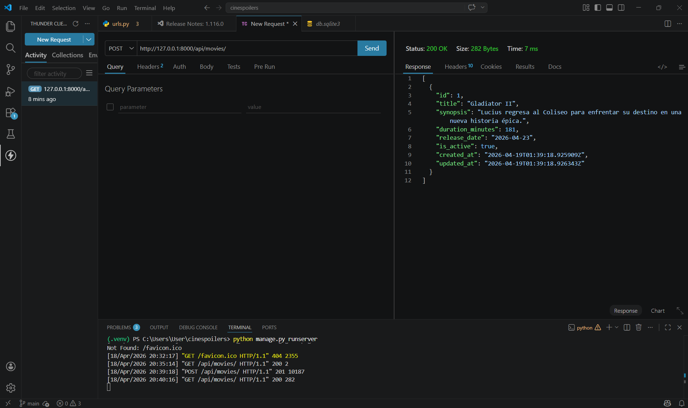
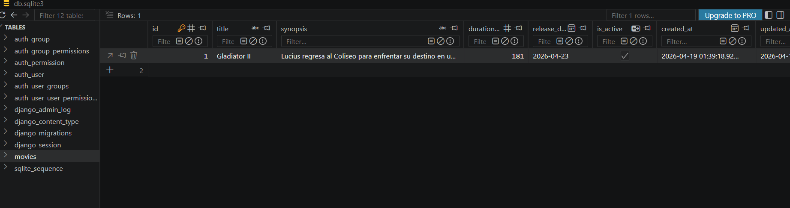
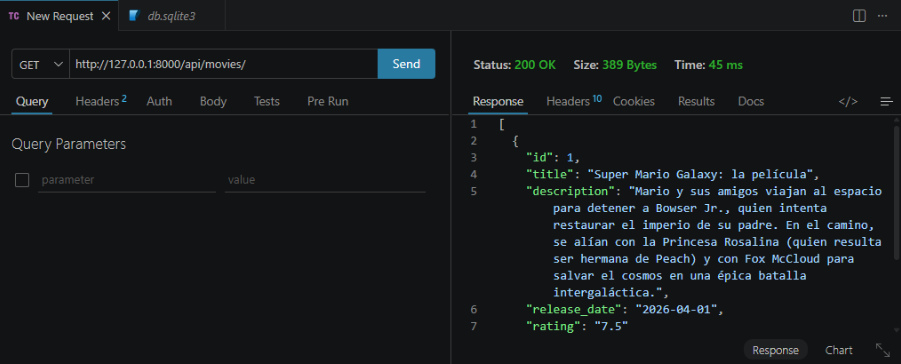

---

## 📌 POST - Crear datos

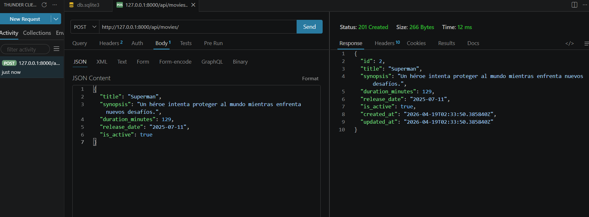
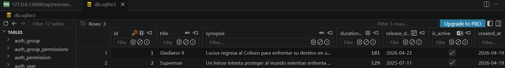
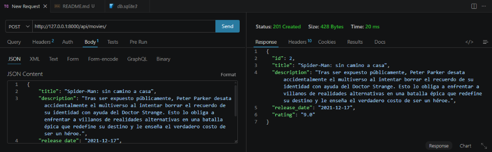

---

## 📌 PUT - Actualización completa

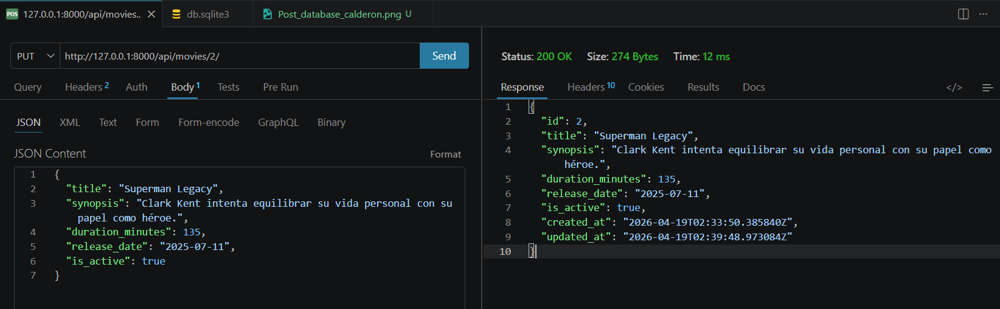
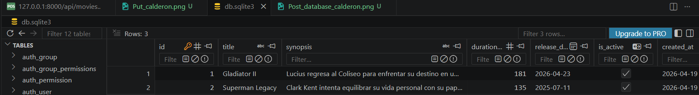

---

## 📌 PATCH - Actualización parcial

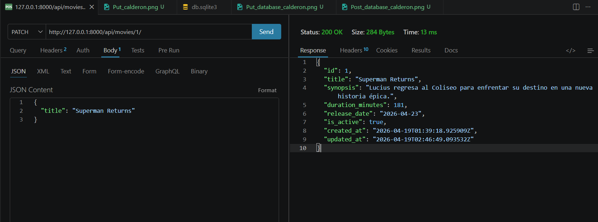
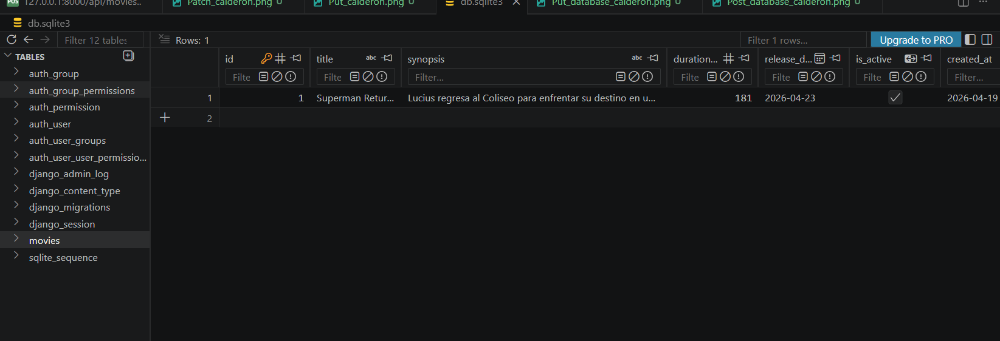

---

## 📌 DELETE - Eliminación

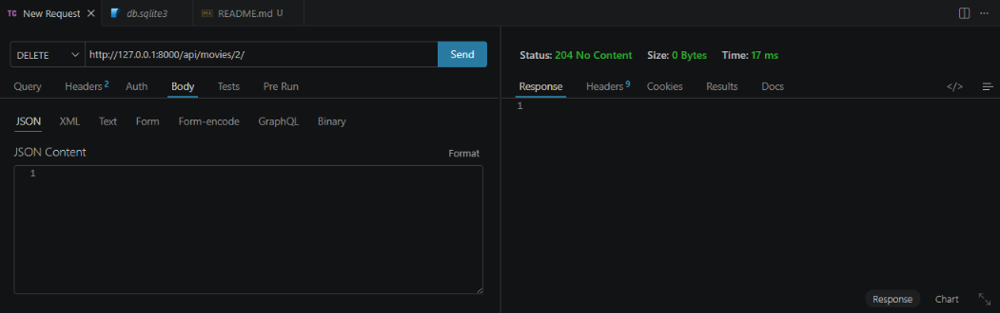
